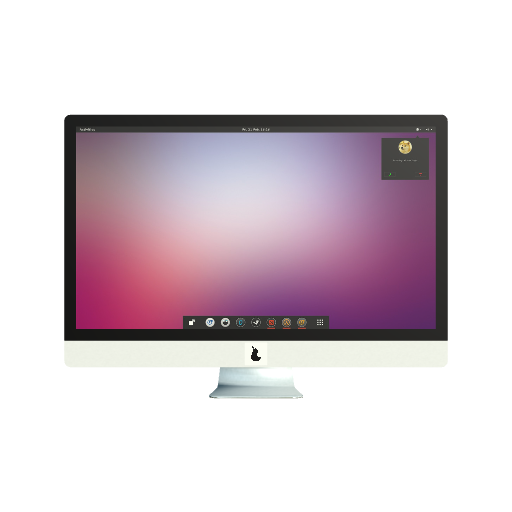

# 27inch iMac

Pros:
  - Screen texture is isolated

Cons:
  - 'Pear', logo is cheaply flating infront of the computer body.
  - Missing port decal on back

| View | Mode | Screenshot |
| ---- | ---- | ---------- |
| [p3d.in](http://p3d.in/SXXUK) | Textured, + |  |
| Blender | IDE |
| [github](https://github.com/thorsummoner/model-iMac27/blob/master/models/iMac%2027in.stl) | Solid, Wireframe | [github (no preview)](https://github.com/thorsummoner/model-iMac27/blob/master/models/iMac%2027in.stl) |
